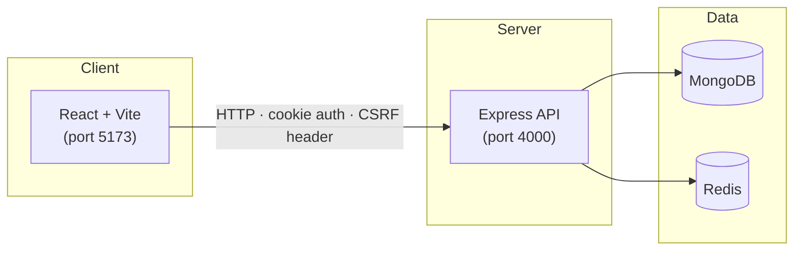

<div align="center">

# 🏟️ QuizArena

**A fullstack online quiz platform — built as a portfolio-ready monorepo.**

[](https://github.com/adityadwic/FullstackProject-BarangkuApps/actions/workflows/ci.yml)


Admin creates and manages quizzes · Participants compete under a timer · Leaderboard ranks the best · Analytics reveal insights

</div>

---

## Table of Contents

- [Features](#features)
- [Tech Stack](#tech-stack)
- [Architecture](#architecture)
- [Monorepo Structure](#monorepo-structure)
- [Getting Started](#getting-started)
- [Environment Variables](#environment-variables)
- [Scripts Reference](#scripts-reference)
- [API Reference](#api-reference)
- [Testing & CI](#testing--ci)
- [Demo Data](#demo-data)
- [License](#license)

---

## Features

| Area | Capabilities |
| --- | --- |
| **Admin** | Login dashboard · quiz CRUD · question management · publish/draft workflow · per-quiz analytics with charts |
| **Participant** | Register & login · browse published quizzes · timed attempts with countdown · answer autosave · resume in-progress attempt · score results · leaderboard |
| **Security** | JWT stored in HTTP-only cookie · CSRF token for state-changing requests · Zod input validation · rate limiting · CORS |
| **DX & Quality** | Monorepo with npm workspaces · shared DTO types · Vitest + Testing Library + Supertest · ESLint + Prettier · GitHub Actions CI |

---

## Tech Stack

<table>
<tr>
<td valign="top" width="33%">

### Frontend
- React 18
- Vite 6
- React Router 6
- Tailwind CSS
- Axios
- Recharts

</td>
<td valign="top" width="33%">

### Backend
- Node.js 20
- Express 4
- TypeScript 5.8
- Mongoose (MongoDB 7)
- Redis 7
- Zod
- JWT + cookie-parser

</td>
<td valign="top" width="33%">

### Tooling
- npm workspaces
- Vitest
- Testing Library
- Supertest
- mongodb-memory-server
- Docker Compose
- ESLint + Prettier
- GitHub Actions

</td>
</tr>
</table>

---

## Architecture



> **Auth flow** — The API issues a JWT inside an HTTP-only cookie on login. Every state-changing request must include a CSRF token header obtained from `GET /api/auth/csrf-token`.

> **Attempt state** — When a participant starts a quiz, attempt data (answers, expiry) is stored in Redis for fast reads. On submit (or auto-submit when time runs out), data is persisted to MongoDB. Leaderboard results are cached in Redis and invalidated on new submissions.

---

## Monorepo Structure

```text
quizarena-monorepo/
├── apps/
│   ├── api/                 # Express REST API
│   │   ├── src/
│   │   │   ├── config/      # env & database setup
│   │   │   ├── controllers/ # route handlers
│   │   │   ├── middleware/   # auth, csrf, rate-limit, validation, logging
│   │   │   ├── models/      # Mongoose schemas (User, Quiz, Question, Attempt, Answer)
│   │   │   ├── routes/      # Express routers
│   │   │   ├── seed/        # demo data seeder
│   │   │   ├── services/    # cache, leaderboard, attempts, sessions, logger
│   │   │   └── utils/       # async handler, http errors, validators, serializers
│   │   └── tests/           # API integration tests (Supertest + mongodb-memory-server)
│   │
│   └── web/                 # React SPA
│       └── src/
│           ├── api/         # Axios client
│           ├── app/         # App root & router
│           ├── components/  # shared UI (Countdown, Layout, ErrorBoundary, ProtectedRoute)
│           ├── features/    # admin & quiz feature modules
│           ├── lib/         # auth form helpers, formatters
│           ├── pages/       # route pages (Home, Auth, Quiz, Attempt, Result, Admin…)
│           ├── styles/      # Tailwind entry
│           └── test/        # component & page tests
│
├── packages/
│   └── shared/              # DTOs & TypeScript types shared across apps
│
├── docker-compose.yml       # MongoDB 7 + Redis 7 (Alpine)
├── .github/workflows/ci.yml # lint → test → build
└── package.json             # workspace root scripts
```

---

## Getting Started

### Prerequisites

| Tool | Version |
| --- | --- |
| Node.js | 20+ |
| npm | 10+ |
| Docker | Any recent version (for MongoDB & Redis) |

### Quick Start

```bash
# 1 · Clone the repository
git clone https://github.com/adityadwic/FullstackProject-BarangkuApps.git
cd FullstackProject-BarangkuApps

# 2 · Install dependencies
npm install

# 3 · Start MongoDB & Redis
docker compose up -d

# 4 · Create environment files
cp apps/api/.env.example apps/api/.env
cp apps/web/.env.example apps/web/.env

# 5 · Seed demo data
npm run seed

# 6 · Start dev servers
npm run dev
```

Once everything is running:

| Service | URL |
| --- | --- |
| Web app | <http://localhost:5173> |
| API | <http://localhost:4000> |
| Health check | <http://localhost:4000/api/health> |

> **Tip:** You can run each app individually with `npm run dev --workspace apps/api` or `npm run dev --workspace apps/web`.

---

## Environment Variables

### `apps/api/.env`

| Variable | Default | Description |
| --- | --- | --- |
| `PORT` | `4000` | API server port |
| `MONGODB_URI` | `mongodb://127.0.0.1:27017/quizarena` | MongoDB connection string |
| `REDIS_URL` | `redis://127.0.0.1:6379` | Redis connection string |
| `JWT_SECRET` | — | Secret for signing JWTs |
| `COOKIE_SECRET` | — | Secret for signing cookies |
| `CLIENT_URL` | `http://localhost:5173` | Allowed CORS origin |
| `LOG_LEVEL` | `info` | Log verbosity |
| `SEED_ADMIN_NAME` | `QuizArena Admin` | Seeded admin name |
| `SEED_ADMIN_EMAIL` | `admin@quizarena.dev` | Seeded admin email |
| `SEED_ADMIN_PASSWORD` | `Admin123!` | Seeded admin password |

### `apps/web/.env`

| Variable | Default | Description |
| --- | --- | --- |
| `VITE_API_URL` | `http://localhost:4000/api` | API base URL |

---

## Scripts Reference

### Root

| Command | Description |
| --- | --- |
| `npm run dev` | Run API & web in parallel |
| `npm run build` | Build all workspaces |
| `npm run test` | Run all tests |
| `npm run lint` | Lint all workspaces |
| `npm run format` | Auto-format with Prettier |
| `npm run format:check` | Check formatting |
| `npm run seed` | Seed demo data |

### Per Workspace

| Command | API | Web |
| --- | --- | --- |
| `dev` | `npm run dev -w apps/api` | `npm run dev -w apps/web` |
| `build` | `npm run build -w apps/api` | `npm run build -w apps/web` |
| `test` | `npm run test -w apps/api` | `npm run test -w apps/web` |
| `lint` | `npm run lint -w apps/api` | `npm run lint -w apps/web` |
| `seed` | `npm run seed -w apps/api` | — |
| `preview` | — | `npm run preview -w apps/web` |

---

## API Reference

### Auth

| Method | Endpoint | Description |
| --- | --- | --- |
| `GET` | `/api/auth/csrf-token` | Get CSRF token |
| `POST` | `/api/auth/register` | Register a new participant |
| `POST` | `/api/auth/login` | Login (sets JWT cookie) |
| `GET` | `/api/auth/me` | Get current user |
| `POST` | `/api/auth/logout` | Logout (clears cookie) |

### Quizzes

| Method | Endpoint | Description |
| --- | --- | --- |
| `GET` | `/api/quizzes` | List quizzes |
| `GET` | `/api/quizzes/:id` | Get quiz detail |
| `POST` | `/api/quizzes` | Create quiz (admin) |
| `PUT` | `/api/quizzes/:id` | Update quiz (admin) |
| `DELETE` | `/api/quizzes/:id` | Delete quiz (admin) |
| `PATCH` | `/api/quizzes/:id/publish` | Publish a quiz (admin) |
| `POST` | `/api/quizzes/:id/questions` | Add question (admin) |
| `POST` | `/api/quizzes/:id/start` | Start an attempt |
| `GET` | `/api/quizzes/:id/active-attempt` | Get active attempt ID |
| `GET` | `/api/quizzes/:id/leaderboard` | Get leaderboard |
| `GET` | `/api/quizzes/:id/analytics` | Get analytics (admin) |

### Questions

| Method | Endpoint | Description |
| --- | --- | --- |
| `PUT` | `/api/questions/:id` | Update question (admin) |
| `DELETE` | `/api/questions/:id` | Delete question (admin) |

### Attempts

| Method | Endpoint | Description |
| --- | --- | --- |
| `GET` | `/api/attempts/:id/session` | Get attempt session |
| `POST` | `/api/attempts/:id/answer` | Save an answer |
| `POST` | `/api/attempts/:id/submit` | Submit attempt |
| `GET` | `/api/attempts/:id/result` | Get attempt result |

---

## Testing & CI

### Test Infrastructure

- **API:** Integration tests using Supertest against an in-memory MongoDB (via `mongodb-memory-server`) — no external DB needed.
- **Web:** Component and page tests using Vitest + Testing Library + jsdom.
- **CI:** GitHub Actions runs `lint → test → build` on every push to `main`/`master` and on pull requests.

### Run Locally

```bash
npm run lint        # ESLint across all workspaces
npm run test        # Vitest across all workspaces
npm run build       # TypeScript compile + Vite production build
```

---

## Demo Data

The seed script (`npm run seed`) creates ready-to-use demo data:

| Item | Count |
| --- | --- |
| Admin account | 1 |
| Published quizzes | 3 |
| Draft quizzes | 2 |
| **Total quizzes** | **5** |

### Admin Credentials

| Field | Value |
| --- | --- |
| Email | `admin@quizarena.dev` |
| Password | `Admin123!` |

> Participants can self-register through the web app.

---

## License

This project is licensed under the [MIT License](LICENSE).
